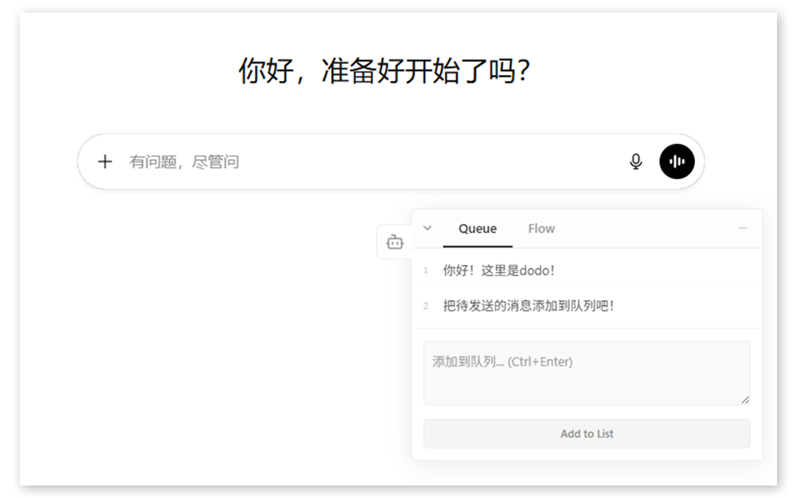

# dodo - AI Chat Flow & Message Queue

管理你的 AI 对话工作流 —— 在 ChatGPT 和 Gemini 等 AI 上草拟并排序待提交消息、快速导航对话历史。

    
    

  

---

你是否在阅读 AI 长回复时冒出五个想法，却在阅读完后只记得两个？
你是否也总要不断向上翻找，只为重看之前的某段对话？

**dodo** 就是为解决这个问题而生的。

## dodo 是什么？

dodo 是一个轻量级侧边栏工具，直接嵌入在你的 ChatGPT 和 Gemini 页面中，提供两项核心能力：

### 1. 消息队列 (Queue)
在阅读 AI 回复的同时，随手草拟和排列多条待发送消息。再也不会丢失你的思路。准备好后，逐条发送或填入输入框继续编辑。
- **一键填入 及 一键发送**：快速与 AI 交互。
- **拖拽排序**：灵活调整消息发送的优先级。

### 2. 对话流 (Flow)
自动识别当前对话中你发送过的每一条消息，生成带编号的索引列表，点击即可秒速跳转。
- **快速定位**：在冗长复杂的对话中不再迷路。
- **实时追踪**：在侧边栏同步展示你当前的阅读位置。

## 为什么选择 dodo？

*   **捕捉灵感**：想法出现的瞬间就能捕捉，不打断阅读节奏。
*   **保持有序**：把混乱的多轮对话变成可导航的结构化会话。
*   **零打扰设计**：安静地待在页面边缘。支持**自由拖动**、**边缘吸附**以及**最小化**隐藏。
*   **跨平台支持**：同时完美适配 ChatGPT 和 Gemini 网页端。
*   **隐私优先**：所有数据仅存储在浏览器本地（Chrome Storage），无账号、无服务器、无任何追踪。

## 安装方法

1.  下载本项目代码。
2.  打开 Chrome 浏览器，进入 `chrome://extensions/`。
3.  开启右上角的“开发者模式”。
4.  点击“加载解压的扩展程序”，选择本项目所在的文件夹。

---

Manage your AI chat workflow — draft and reorder pending messages, and quickly navigate conversation history on ChatGPT, Gemini, and other AI platforms.

Ever had five ideas pop up while reading a long AI response, only to remember two by the time you finished?
Ever found yourself endlessly scrolling up just to revisit a previous part of the conversation?

**dodo** was built to solve exactly that.

## What is dodo?

dodo is a lightweight sidebar tool that lives right on your ChatGPT, Gemini, and other AI pages, providing two core capabilities:

### 1. Message Queue
Draft and line up multiple messages while you're still reading the AI's response. Never lose your train of thought again. When you're ready, send them one by one or fill them into the input box for further editing.
- **One-click fill & one-click send**: Interact with AI faster.
- **Drag & drop to reorder priorities**: Flexible management of your prompts.

### 2. Conversation Flow
Automatically detects every message you've sent in the current conversation and generates a numbered index. Click any entry to jump straight to it.
- **Instantly locate anything**: Never get lost in long, complex conversations.
- **Real-time tracking**: Your current reading position is highlighted in the sidebar.

## Why install dodo?

*   **Think faster**: Capture ideas the instant they appear, without breaking your reading flow.
*   **Stay organized**: Turn chaotic multi-turn conversations into structured, navigable sessions.
*   **Zero distraction**: Sits quietly at the edge of your page. Draggable, dockable, and minimizable to a tiny icon.
*   **Multi-platform**: Works on ChatGPT, Gemini, and other AI web interfaces.
*   **Privacy-first**: All data stays in your browser's local storage. No accounts, no servers, no tracking.

---

*让 AI 对话变得更有序、更高效。 / Make AI conversations more organized and efficient.*
